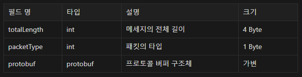
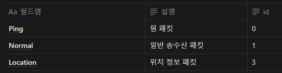
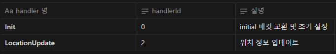

# tcp_game

### 서버 링크

- 3.35.219.35 : 5555

### 기능 정의

- 프로젝트 구성
  - 게임 인스턴스 생성
 
- 유저 접속
  - 유저 인스턴스 생성
  - 위치 패킷 교환

- DB 연동
  - DB에 테이블이 없으면 users 테이블 생성
  - 게임 시작 시 저장된 유저의 위치 정보를 불러옴
  - 게임 종료 시 유저의 마지막 위치 저장

### 바이트 배열 구조



### 패킷 구조



### Handler



### 파일 구조
```markdown
tcp_game/
│  .env
│  .gitignore
│  .prettierrc
│  package-lock.json
│  package.json
│  README.md
│  
├─nodeSample
├─생략(client file)
├─node_modules
├─생략(package file)
└─src
    │  server.js
    │  
    ├─class
    │  ├─manager
    │  │      interval.manager.js
    │  │      
    │  └─model
    │          game.class.js
    │          user.class.js
    │          
    ├─config
    │      config.js
    │      
    ├─constants
    │      env.js
    │      handlerIds.js
    │      header.js
    │      
    ├─DB
    │  │  database.js
    │  │  
    │  ├─migration
    │  │      createSchema.js
    │  │      
    │  ├─sql
    │  │      user_db.sql
    │  │      
    │  └─user
    │          user.queries.js
    │          user_db.js
    │          
    ├─event
    │      onConnection.js
    │      onData.js
    │      onEnd.js
    │      onError.js
    │      
    ├─handlers
    │      index.js
    │      init.handler.js
    │      locationUpdate.handler.js
    │      
    ├─init
    │  │  index.js
    │  │  loadProtos.js
    │  │  
    │  └─setting
    │          init.game.js
    │          
    ├─notification
    │      game.notification.js
    │      
    ├─protobuf
    │  │  packetNames.js
    │  │  
    │  ├─common
    │  │      common.proto
    │  │      
    │  └─request
    │          initial.proto
    │          location.proto
    │          response.proto
    │          
    ├─session
    │      game.session.js
    │      session.js
    │      user.session.js
    │      
    └─utils
        └─parser
                packetParser.js
                
